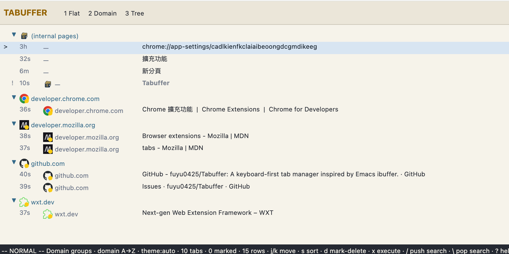
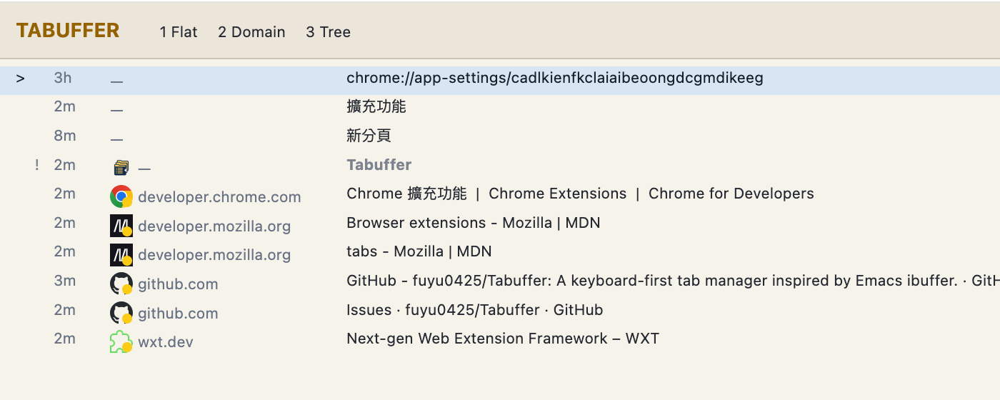
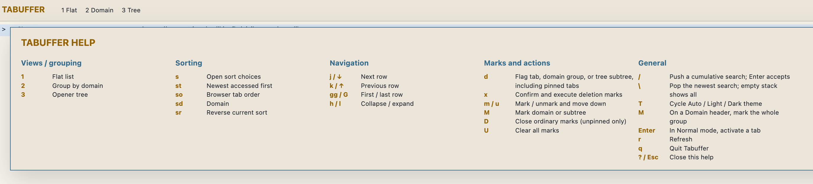

<p align="center">
  
</p>

<h1 align="center">Tabuffer</h1>

<p align="center">
  A keyboard-first tab manager inspired by Emacs <code>ibuffer</code>.
</p>

Tabuffer turns your open tabs into a fast, searchable buffer list. Navigate without leaving the keyboard, switch between flat, domain, and opener-tree views, mark several tabs, and close them as one deliberate operation.

## Demo

**Domain view**



**Flat view**



**Sort menu**


**Help menu**



> [!NOTE]
> Tabuffer is preparing for Firefox Add-ons and the Chrome Web Store. Until those listings are available, install it from source using the instructions below.

## Highlights

- Three sortable views: a flat list, collapsible domain groups, and opener trees.
- Familiar `ibuffer`-style deletion: press `d` to flag tabs, then `x` and `y` to confirm.
- Cumulative search: each accepted `/` search narrows the current result; `\` removes the newest layer.
- Keyboard navigation with `j`/`k`, arrow keys, `gg`, `G`, `h`, and `l`.
- Browser-provided favicons, with no third-party favicon service.
- Auto, Light, and Dark themes with a warm, low-glare light palette.
- Deliberate pinned-tab deletion through the confirmed `d`/`x` workflow; ordinary bulk marks remain protected.
- Live updates when tabs open, close, move, or change.
- Remembers only the selected view, sort mode and direction, and theme between sessions. Search layers and marks remain page-local.

## Keyboard reference

Press `?` inside Tabuffer for the built-in reference.

### Views and sorting

| Key | Action |
| --- | --- |
| `1` | Flat list |
| `2` | Group by domain |
| `3` | Opener tree |
| `s` | Open the sort which-key panel |
| `st` | Sort by newest access |
| `so` | Sort by browser tab order |
| `sd` | Sort by domain |
| `sr` | Reverse the current sort direction |
| `T` | Cycle Auto → Light → Dark appearance |

The selected sort and direction apply to every view. Domain mode orders both groups and their tabs. Tree mode recursively sorts siblings—including top-level roots—without moving a tab away from its opener parent. Reverse mode means oldest-first, reverse browser order, or domain Z→A.

Auto is the default theme and follows the browser's current system color scheme.

### Navigation

| Key | Action |
| --- | --- |
| `j` / `↓` | Select the next row |
| `k` / `↑` | Select the previous row |
| `J` / `K` or `Shift+↓` / `Shift+↑` | Select the next / previous Domain header in Domain view |
| `Page Down` / `Page Up` | Select the next / previous visible page |
| `gg` / `G` | Select the first / last row |
| `h` / `l` | Collapse / expand a domain or tree branch |
| `Enter` | Activate the selected tab |
| `r` | Refresh |
| `q` | Close Tabuffer |

### Searching

| Key | Action |
| --- | --- |
| `/` | Start a search |
| `Enter` | Accept it and push it onto the search stack |
| `Escape` | Cancel the search being entered |
| `\` | Pop the newest accepted search; an empty stack shows all tabs |

Search matches tab titles, URLs, and domains. Accepted searches are cumulative and last only as long as the Tabuffer page.

### Marks and deletion

| Key | Action |
| --- | --- |
| `d` | Flag a tab or Tree subtree and move down; on a Domain header, flag its children and jump to another domain |
| `x` | Ask to execute deletion flags; confirm with `y` or cancel with `n` |
| `m` / `u` | Add / remove a mark and move down; on a Domain header, `u` clears all child marks and jumps |
| `*` | Toggle an ordinary mark without moving |
| `M` | Mark the selected domain or opener subtree |
| `D` | On a Domain header, flag its children and jump to another domain; otherwise close ordinary marks |
| `U` | Clear every mark and deletion flag |

Deletion flags may include pinned tabs, so `d`, `x`, and `y` can deliberately close them. Ordinary `m`/`M` marks still exclude pinned tabs, and the Tabuffer manager tab is always protected.

## Install from source

You need a recent Node.js LTS release and npm.

Clone or download this repository, then run:

```sh
cd Tabuffer
npm ci
```

### Firefox development and debugging

```sh
npm run build:firefox
```

1. Open `about:debugging` in Firefox.
2. Select **This Firefox**.
3. Select **Load Temporary Add-on**.
4. Choose `dist/firefox-mv3/manifest.json`.

This development installation is unsigned and temporary: Firefox removes it when the browser restarts. Rebuild, then select **Reload** on the extension in `about:debugging` after code changes.

### Firefox packaged installation

Create the Firefox store archive, source archive, and unsigned XPI:

```sh
npm run package:firefox
```

This produces:

```text
dist/tabuffer-0.1.0-firefox.zip   AMO submission archive
dist/tabuffer-0.1.0-firefox.xpi   identical extension archive with an XPI name
dist/tabuffer-0.1.0-sources.zip   source archive for Mozilla review
```

The locally generated XPI is **not signed by Mozilla**. To test it persistently, use Firefox Developer Edition, Nightly, or another compatible build that honors `xpinstall.signatures.required=false`:

1. Open `about:config`, set `xpinstall.signatures.required` to `false`, and restart Firefox if requested.
2. Open `about:addons`.
3. Open the gear menu and select **Install Add-on From File**.
4. Choose `dist/tabuffer-0.1.0-firefox.xpi` and approve its permissions.

Standard Firefox requires a Mozilla-signed XPI. Submit the Firefox ZIP and source ZIP to AMO—or use AMO's unlisted signing channel—then install the signed XPI through the same **Install Add-on From File** menu. Signed and supported XPI installations persist across restarts.

### Chrome development and debugging

```sh
npm run build:chrome
```

1. Open `chrome://extensions`.
2. Enable **Developer mode**.
3. Select **Load unpacked**.
4. Choose `dist/chrome-mv3`.

The unpacked extension remains installed across browser restarts as long as the `dist/chrome-mv3` folder stays available. After rebuilding, select Tabuffer's **Reload** button on `chrome://extensions`. Click its toolbar icon to open or focus the manager.

### Chrome packaged distribution

Create the Chrome Web Store archive:

```sh
npm run package:chrome
```

This produces `dist/tabuffer-0.1.0-chrome.zip`. Upload that ZIP to the Chrome Web Store. Chrome does not install the ZIP directly from `chrome://extensions`; use the unpacked development workflow above or install a published store release.

## Privacy and permissions

Tabuffer requests the `tabs` permission so it can list, activate, and close tabs and read their titles, URLs, and browser-provided favicons.

It does not request host permissions, inject content scripts, read page contents, use analytics, or send tab data to an external service. All tab management happens locally in the browser.

## Development

```sh
npm test
npm run typecheck
npm run build:chrome
npm run build:firefox
```

Run browser builds sequentially: WXT writes generated files beneath the shared `dist` directory.

Create every browser package in sequence:

```sh
npm run package
```

The Firefox manifest uses the stable extension ID `tabuffer@fuyu0425.github.io`. Generated builds and archives stay beneath the ignored `dist` directory.

### Project layout

```text
src/
├── browser/       WebExtensions adapter
├── core/          tab model, filtering, sorting, and view projections
├── entrypoints/   background action and Tabuffer manager page
├── input/         keyboard state machine
├── public/        extension icons
└── ui/            controller, renderer, and status line
tests/             renderer and configuration integration tests
```

The core modules remain browser-independent. Browser API calls belong in `src/browser`, while DOM behavior belongs in `src/ui`.

## Contributing

Issues and focused pull requests are welcome. Please:

1. Keep the interface keyboard-first and browser-neutral.
2. Add a regression test before changing behavior.
3. Avoid new permissions, network services, and dependencies unless the benefit is explicit.
4. Run the complete verification commands above before submitting.

See [AGENTS.md](AGENTS.md) for the repository's detailed engineering rules.

## License

Tabuffer is available under the [MIT License](LICENSE).

## Companion projects

These projects solve related tab-management problems with different purposes and interaction styles:

- [kTab Manager](https://addons.mozilla.org/firefox/addon/ktab-manager/) is a fast keyboard-first switcher with domain and window grouping, usage-based sorting, and duplicate cleanup.
- [Sidebery](https://addons.mozilla.org/firefox/addon/sidebery/) is a persistent Firefox sidebar for tab trees, panels, containers, bookmarks, and snapshots.
- [Tree Style Tab](https://addons.mozilla.org/firefox/addon/tree-style-tab/) provides a mature tree-oriented tab sidebar for Firefox.
- [HelloTabs](https://addons.mozilla.org/firefox/addon/hellotabs/) offers fuzzy tab search, quick switching, sorting, and conventional batch actions.

Tabuffer stays focused on an Emacs `ibuffer`-style list: keyboard-driven views, cumulative filtering, marks, and deliberate mark-then-execute actions.

## References

- [Temporary extension installation in Firefox](https://extensionworkshop.com/documentation/develop/temporary-installation-in-firefox/)
- [Packaging Firefox extensions and XPI files](https://extensionworkshop.com/documentation/publish/package-your-extension/)
- [Signing and self-distributing Firefox extensions](https://extensionworkshop.com/documentation/publish/self-distribution/)
- [Loading an unpacked extension in Chrome](https://developer.chrome.com/docs/extensions/get-started/tutorial/hello-world#load-unpacked)
- [Publishing extensions with WXT](https://wxt.dev/guide/essentials/publishing)
